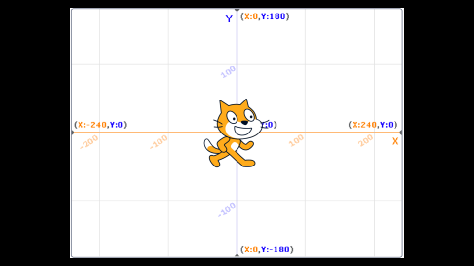

[Lecture 0](#lecture-0)
=======================

[toc]

Computer Science. Computational Thinking. Problem Solving: Inputs, Outputs. Representation: Unary, Binary, Decimal, ASCII, Unicode, RGB. Abstraction. Algorithms. Running Times. Pseudocode. Scratch: Functions, Arguments, Return Values; Variables; Boolean Expressions, Conditionals; Loops; Events; Threads.
[Video](https://youtu.be/3LPJfIKxwWc)

[Welcome!](#welcome)
--------------------

*   This class is about more than computer programming!
*   Indeed, this class is about problem-solving in a way that is exceedingly empowering! You will likely take the problem solving that you learn here will likely be instantly applicable to your work beyond this course and even your career as a whole!
*   However, it will not be easy! You will be “drinking from the firehose” of knowledge during this course. You’ll be amazed at what you will be able to accomplish in the coming weeks.
*   This course is far more about you advancing “you” from “where you are today” than hitting some imagined standard.
*   The most important opening consideration in this course: Give the time you need to learn through this course. Everyone learns differently. If something does not work out well at the start, know that with time you will grow and grow in your skill.
*   Don’t be scared if this is your first computer science class! For most of your peers, this is their first computer science class too!

[What’s Ahead](#whats-ahead)
----------------------------

*   You will be learning this week about Scratch, a visual programming language.
*   Then, in future weeks, you will learn about C. That will look something like this:
    
    ```
    #include <stdio.h>  
    int main(void)
    {
      printf("hello, world\n");
    } 
    ```
    
*   Further, as the weeks progress, you will learn about algorithms.
*   You will learn about memory.
*   You will learn about buggy code and what causes computer crashes.
*   You will learn about data structures such as a hash table.
*   Then, we will transition to a new, higher-level language called _Python_. Your code will look something like this:
    
    ```
    print("hello, world") 
    ```
    
*   This class will give you a strong understanding of how recent programming languages developed from the earlier ones.
*   You will learn SQL, JavaScript, HTML, and CSS.
*   We will also be looking at how we can use databases and third-party frameworks to build web applications.

[Community!](#community)
------------------------

*   You are part of a community of those taking this course at Harvard College, Harvard Extension School, and via edX.org.
*   Puzzle Day and the CS50 Fair
*   You can attend CS50 Lunches and CS50 Hackathon, if you are student on Harvard’s campus.

[Computer Science](#computer-science)
-------------------------------------

*   Essentially, computer programming is about taking some input and creating some output - thus solving a problem. What happens in between the input and output, what we could call _a black box,_ is the focus of this course.
    
    
    
*   For example, we may need to take attendance for a class. We could use a system called _unary_ to count, one finger at a time.
*   Computers today count using a system called _binary_. It’s from the term _binary digit_ that we get a familiar term called _bit_. A _bit_ is a zero or one: on or off.
*   Computers only speak in terms of zeros and ones. Zeros represent _off._ Ones represent _on._ Computers are millions, and perhaps billions, of transistors that are being turned on and off.
*   If you imagine using a light bulb, a single bulb can only count from zero to one.
*   However, if you were to have three light bulbs, there are more options open to you!
*   Using three light bulbs, the following could represent zero:
    
    ```
    0 0 0 
    ```
    
*   Similarly, the following would represent one:
    
    ```
    0 0 1 
    ```
    
*   By this logic, we could propose that the following equals two:
    
    ```
    0 1 0 
    ```
    
*   Extending this logic further, the following represents three:
    
    ```
    0 1 1 
    ```
    
*   Four would appear as:
    
    ```
    1 0 0 
    ```
    
*   We could, in fact, using only three light bulbs count as high as seven!
    
    ```
    1 1 1 
    ```
    
*   As a heuristic, we could imagine that the following values represent each possible place in our _binary digit_:
    
    ```
    4 2 1 
    ```
    
*   Computers use ‘base-2’ to count. This can be pictured as follows:
    
    ```
    2^2  2^1  2^0
    4    2    1 
    ```
    
*   Therefore, you could say that it would require three bits (the four’s place, the two’s place, and the one’s place) to represent a number as high as seven.
*   Computers generally use eight bits (also known as a _byte_) to represent a number. For example, `00000101` is the number 5 in _binary_. `11111111` represents the number 255.

[ASCII](#ascii)
---------------

*   Just as numbers are binary patterns of ones and zeros, letters are represented using ones and zeros too!
*   Since there is an overlap between the ones and zeros that represent numbers and letters, the _ASCII_ standard was created to map specific letters to specific numbers.
*   For example, the letter `A` was decided to map to the number 65. `01000001` represents the number 65 in binary.
*   If you received a text message, the binary under that message might represent the numbers 72, 73, and 33. Mapping these out to ASCII, your message would look as follows:
    
    ```
    H   I   !
    72  73  33 
    ```
    
*   Thank goodness for standards like ASCII that allow us to agree upon these values!
*   Here is an expanded map of ASCII values:
    
    
    
*   If you wish, you can learn more about [ASCII](https://en.wikipedia.org/wiki/ASCII).
*   Since binary can only count up to _255_ we are limited to the number of characters represented by ASCII.

[Unicode](#unicode)
-------------------

*   As time has rolled on, there are more and more ways to communicate via text.
*   Since there were not enough digits in binary to represent all the various characters that could be represented by humans, the _Unicode_ standard expanded the number of bits that can be transmitted and understood by computers. Unicode includes not only special characters, but emoji as well.
*   There are emoji that you probably use every day. The following may look familiar to you:
    
    
    
*   Computer scientists faced a challenge when wanting to assign various skin tones to each emoji to allow the communication to be further personalized. In this case, the creators and contributors of emoji decided that the initial bits would be the structure of the emoji itself, followed by skin tone.
*   For example, the unicode for a generic thumbs up is `U+1F44D`. However, the following represents the same thumbs up with a different skin tone: `U+1F44D U+1F3FD`.
*   More and more features are being added to the Unicode standard to represent further characters and emoji.
*   If you wish, you can learn more about [Unicode](https://en.wikipedia.org/wiki/Unicode).
*   If you wish, you can learn more about [emoji](https://en.wikipedia.org/wiki/Emoji).

[Representation](#representation)
---------------------------------

*   Zeros and ones can be used to represent color.
*   Red, green, and blue (called `RGB`) is a combination of three numbers.
    
    
    
*   Taking our previously used 72, 73, and 33, which said `HI!` via text, would be interpreted by image readers as a light shade of yellow. The red value would be 72, the green value would be 73, and the blue would be 33.
    
    
    
*   Further, zeros and ones can be used to represent images, videos, and music!
*   Images are simply collections of RGB values.
*   Videos are sequences of many images that are stored together, just like a flipbook.
*   Music can be represented through MIDI data.

[Algorithms](#algorithms)
-------------------------

*   Problem-solving is central to computer science and computer programming.
*   Imagine the basic problem of trying to locate a single name in a phone book.
*   How might you go about this?
*   One approach could be to simply read from page one to the next to the next until reaching the last page.
*   Another approach could be to search two pages at a time.
*   A final and perhaps better approach could be to go to the middle of the phone book and ask, “Is the name I am looking for to the left or to the right?” Then, repeat this process, cutting the problem in half and half and half.
*   Each of these approaches could be called algorithms. The speed of each of these algorithms can be pictured as follows in what is called _big-O notation_:
    
    
    
    Notice that the first algorithm, highlighted in red, has a big-O of `n` because if there are 100 names in the phone book, it could take up to 100 tries to find the correct name. The second algorithm, where two pages were searched at a time, has a big-O of ‘n/2’ because we searched twice as fast through the pages. The final algorithm has a big-O of log2n as doubling the problem would only result in one more step to solve the problem.
    

[Pseudocode](#pseudocode)
-------------------------

*   The ability to create _pseudocode_ is central to one’s success in both this class and in computer programming.
*   Pseudocode is a human-readable version of your code. For example, considering the third algorithm above, we could compose pseudocode as follows:
    
    ```
    1  Pick up phone book
    2  Open to middle of phone book
    3  Look at page
    4  If person is on page
    5      Call person
    6  Else if person is earlier in book
    7      Open to middle of left half of book
    8      Go back to line 3
    9  Else if person is later in book
    10     Open to middle of right half of book
    11     Go back to line 3
    12 Else
    13     Quit 
    ```
    
*   Pseudocoding is such an important skill for at least two reasons. First, when you pseudocode before you create formal code, it allows you to think through the logic of your problem in advance. Second, when you pseudocode, you can later provide this information to others that are seeking to understand your coding decisions and how your code works.
*   Notice that the language within our pseudocode has some unique features. First, some of these lines begin with verbs like _pick up,_ _open,_ _look at._ Later, we will call these _functions_.
*   Second, notice that some lines include statements like `if` or `else if.` These are called _conditionals_.
*   Third, notice how there are expressions that can be stated as _true_ or _false,_ such as “person is earlier in the book.” We call these _boolean expressions_.
*   Finally, notice how these statements like “go back to line 3.” We call these _loops_.
*   These building blocks are the fundamentals of programming.
*   In the context of _Scratch_, which is discussed below, we will use each of the above basic building blocks of programming.

[Artificial Intelligence](#artificial-intelligence)
---------------------------------------------------

*   Consider how we can utilize the building blocks above to start creating our own artificial intelligence. Look at the following pseudocode:
    
    ```
    If student says hello
        Say hello back
    Else if student says goodbye
        Say goodbye back
    Else if student asks how you are
        Say you're well
    Else if student asks why 111 in binary is 7 in decimal
    ... 
    ```
    
    Notice how just to program a handful of interactions, many lines of code would be required. How many lines of code would be required for thousands or tens of thousands of possible interactions?
    
*   `large language models` look at patterns in large blocks of language. Such language models attempt to create a best guess of what words come after one another or alongside one another.
*   As very useful in many avenues of life and work, we stipulate that the utilization of AI-based software other than CS50’s own is _not reasonable_.
*   CS50’s own AI-based software tool called [CS50 Duck](https://cs50.ai) is an AI helper that you can use during this course. It will help you, but not give away the entire answers to the course’s problems.

[Scratch](#scratch)
-------------------

*   _Scratch_ is a visual programming language developed by MIT.
*   Scratch utilizes the same essential coding building blocks that we covered earlier in this lecture.
*   Scratch is a great way to get into computer programming because it allows you to play with these building blocks in a visual manner, not having to be concerned about the syntax of curly braces, semicolons, parentheses, and the like.
*   Scratch `IDE` (integrated development environment) looks like the following:
    
    
    
    Notice that on the left, there are _building blocks_ that you can use in your programming. To the immediate right of the building blocks, there is the area to which you can drag blocks to build a program. To the right of that, you see the _stage_ where a cat stands. The stage is where your programming comes to life.
    
*   Scratch operates on a coordinate system as follows:
    
    
    
    Notice that the center of the stage is at coordinate (0,0). Right now, the cat’s position is at that same position.
    

[Hello World](#hello-world)
---------------------------

*   To begin, drag the “when green flag clicked” building block to the programming area. Then, drag the `say` building block to the programming area and attach it to the previous block.
    
    
    
    Notice that when you click the green flag now, on the stage, the cat says, “hello world.”
    
*   This illustrates quite well what we were discussing earlier regarding programming:
    
    
    
    Notice that the input `hello world` is passed to the function `say`, and the _side effect_ of that function running is the cat saying `hello world`.
    

[Hello, You](#hello-you)
------------------------

*   We can make your program more interactive by having the cat say `hello` to someone specific. Modify your program as below:
    
    
    
    Notice that when the green flag is clicked, the function `ask` is run. The program prompts you, the user, `What's your name?` It then stores that name in the _variable_ called `answer`. The program then passes `answer` to a special function called `join`, which combines two strings of text `hello`, and whatever name was provided. These collectively are passed to the `say` function. The cat says, `Hello,` and a name. Your program is now interactive.
    
*   Quite similarly, we can modify our program as follows:
    
    
    
    Notice that this program, when the green flag is clicked, passes the same variable, joined with `hello`, to a function called `speak`.
    

[Meow and Abstraction](#meow-and-abstraction)
---------------------------------------------

*   Along with pseudocoding, _abstraction_ is an essential skill and concept within computer programming.
*   Abstraction is the act of simplifying a problem into smaller and smaller problems.
*   For example, if you were hosting a huge dinner for your friends, the _problem_ of having to cook the entire meal could be quite overwhelming! However, if you break down the task of cooking the meal into smaller and smaller tasks (or problems), the big task of creating this delicious meal might feel less challenging.
*   In programming, and even within Scratch, we can see abstraction in action. In your programming area, program as follows:
    
    
    
    Notice that you are doing the same thing over and over again. Indeed, if you see yourself repeatedly coding the same statements, it’s likely the case that you could program more artfully – abstracting away this repetitive code.
    
*   You can modify your code as follows:
    
    
    
    Notice that the loop does exactly as the previous program did. However, the problem is simplified by abstracting away the repetition to a block that _repeats_ the code for us.
    
*   We can even advance this further by using the `define` block, where you can create your own block (your own function)! Write code as follows:
    
    
    
    Notice that we are defining our own block called `meow`. The function plays the sound `meow`, then waits one second. Below that, you can see that when the green flag is clicked, our meow function is repeated three times.
    
*   We can even provide a way by which the function can take an input `n` and repeat a number of times:
    
    
    
    Notice how `n` is taken from “meow n times.” `n` is passed to the meow function through the `define` block.
    
*   The cat, by the way, we can call a `sprite` – a general term used in game programming for an object or character on the screen with which the player will interact.

[Conditionals](#conditionals)
-----------------------------

*   _conditionals_ are an essential building block of programming, where the program looks to see if a specific condition has been met. If a condition is met, the program does something.
*   To illustrate a conditional, write code as follows:
    
    
    
    Notice that the `forever` block is utilized such that the `if` block is triggered over and over again, such that it can check continuously if the cat is touching the mouse pointer.
    
*   We can modify our program as follows to integrate video sensing:
    
    
    
*   Remember, programming is often a process of trial and error. If you get frustrated, take time to talk yourself through the problem at hand. What is the specific problem that you are working on right now? What is working? What is not working?

[Oscartime](#oscartime)
-----------------------

*   We showed you in this lecture a number of Scratch programs to stoke your imagination.
*   _Oscartime_ is one of David’s own Scratch programs – though the music may haunt him because of the number of hours he listened to it while creating this program. Take a few moments to play through the game yourself.
*   Building Oscartime ourselves, we first add the lamp post.
    
    
    
*   Then, write code as follows:
    
    
    
    Notice that moving your mouse over Oscar changes his costume. You can learn more by [exploring these code blocks](https://scratch.mit.edu/projects/565100517).
    
*   Then, modify your code as follow to create a falling piece of trash:
    
    
    
    Notice that the trash’s position on the y-axis always begins at 180. The x position is randomized. While the trash is above the floor, it goes down 3 pixels at a time. You can learn more by [exploring these code blocks](https://scratch.mit.edu/projects/565117390).
    
*   Next, modify your code as follows to allow for the possibility of dragging trash.
    
    
    
    You can learn more by [exploring these code blocks](https://scratch.mit.edu/projects/565119737).
    
*   Next, we can implement the scoring variables as follows:
    
    
    
    You can learn more by [exploring these code blocks](https://scratch.mit.edu/projects/565472267).
    
*   Go try the full game [Oscartime](https://scratch.mit.edu/projects/277537196).

[Ivy’s Hardest Game](#ivys-hardest-game)
----------------------------------------

*   Moving away from Oscartime to Ivy’s Hardest Game, we can now imagine how to implement movement within our program.
*   Our program has three main components.
*   First, write code as follows:
    
    
    
    Notice that when the green flag is clicked, our sprite moves to the center of the stage at coordinates (0,0) and then listens for the keyboard and checks for walls forever.
    
*   Second, add this second group of code blocks:
    
    
    
    Notice how we have created a custom `listen for keyboard` script. For each of our arrow keys on the keyboard, it will move the sprite around the screen.
    
*   Finally, add this group of code blocks:
    
    
    
    Notice how we also have a custom `feel for walls` script. When a sprite touches a wall, it moves it back to a safe position – preventing it from walking off the screen.
    
*   You can learn more by [exploring these code blocks](https://scratch.mit.edu/projects/326129433).
*   Go try the full game [Ivy’s Hardest Game](https://scratch.mit.edu/projects/326129433/).
*   Scratch allows for many sprites to be on the screen at once.
*   Adding another sprite, add the following code blocks to your program:
    
    
    
    Notice how the Yale sprite seems to get in the way of the Harvard sprite by moving back and forth. When it bumps into a wall, it turns around until it bumps the wall again. You can learn more by [exploring these code blocks](https://scratch.mit.edu/projects/565127193).
    
*   You can even make a sprite follow another sprite. Adding another sprite, add the following code blocks to your program:
    
    
    
    Notice how the MIT logo now seems to follow around the Harvard one. You can learn more by [exploring these code blocks](https://scratch.mit.edu/projects/565479840).
    
*   Go try the full game [Ivy’s Hardest Game](https://scratch.mit.edu/projects/565742837).

[Summing Up](#summing-up)
-------------------------

In this lesson, you learned how this course sits in the wide world of computer science and programming. You learned…

*   Few students come to this class with prior programming experience!
*   You are not alone! You are part of a community.
*   Problem solving is the essence of the work of computer scientists.
*   This course is not simply about programming – this course will introduce you to a new way of learning that you can apply to almost every area of life.
*   How numbers, text, images, music, and video are understood by computers.
*   The fundamental programming skill of pseudocoding.
*   Reasonable and unreasonable ways to utilize AI in this course.
*   How abstraction will play a role in your future work in this course.
*   The basic building blocks of programming, including functions, conditionals, loops, and variables.
*   How to build a project in Scratch.

See you next time!